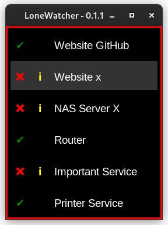

# LoneWatcher

**LoneWatcher** is a lightweight, decentralized monitoring tool designed to run independently on a local system. It monitors critical services, pings IP addresses, and checks HTTP endpoints without relying on a central monitoring infrastructure. Ideal for quick, pragmatic system checks, LoneWatcher operates as a solitary sentinel to ensure essential components remain functional.

## Screenshot



## Features

- **Decentralized Monitoring**: Operates independently on a local system.
- **Service Checks**: Monitors critical services to ensure they are running.
- **IP Address Pings**: Regularly pings specified IP addresses to check connectivity.
- **HTTP Endpoint Checks**: Validates the availability of HTTP endpoints.

## Requirements

- Python 3.x
- Linux or Windows operating system

## Installation

Just clone the repository and install the required dependencies:

```bash
git clone https://github.com/KristjanESPERANTO/LoneWatcher
pip install -r requirements.txt
```

## Startup

To start the application, run the following command:

```bash
python main.pyw
```

## Usage

- Configure the services, IP addresses, and HTTP endpoints you want to monitor in the `targets.json` file.
- Start the monitoring process by running the application: `python main.pyw`
- View the logs and alerts generated by the monitoring checks in the console or log files.

## Contributing

Contributions are welcome! If you have suggestions for improvements or new features, please open an issue or submit a pull request.

## License

This project is licensed under the ISC License. See the [LICENSE](LICENSE.md) file for details.

## Development

### Commands

- `make lint` - Run the linter to check code style.

## To Do

- prevent starting more than one instance (as setting)
- ping warning only if it fails n times in a row.
- Hardcode system information
- Log
  - start
  - end
  - switch between green and red
- Move "statuses" handling to GUI? This also would allow to optimize the `clear_highlight` function.
- Add Info button in GUI (with LICENSE, Author, Version and Repository URL)
- create Settings GUI - separate or in GUI
- watch config file or read config file periodically
- hostname specific config
- add linter and formatter / black
